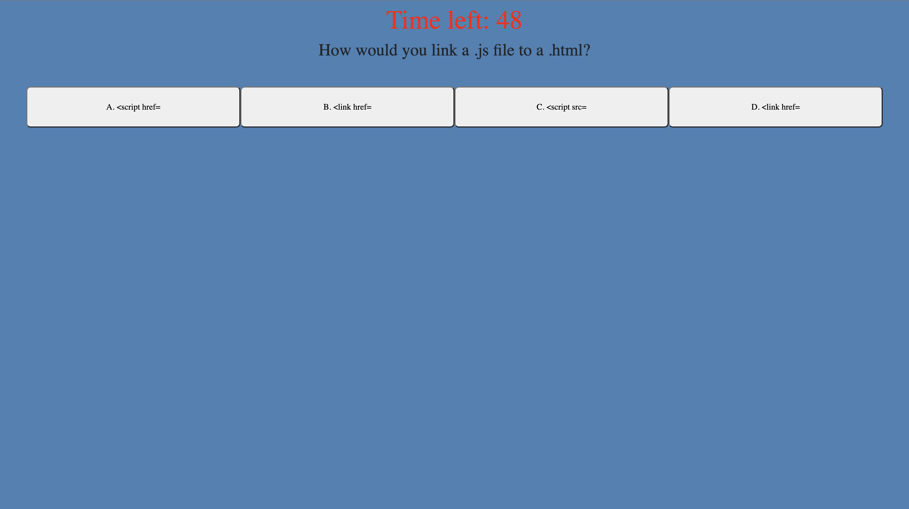

# Code Quiz By Benjamin Jacquez
## Description
Timed Coding Quiz Utalizing Javascript To Count Down From 60 Seconds During A 4 Question Quiz.

## Deployed Website
[Deployed Version Here](https://ben-jacquez.github.io/coding-quiz/)

## Table of Contents
- [Description](#description)
- [Deployed Website](#deployed-website)
- [Technology Used](#technology-used)
- [Usage](#usage)
- [Features](#features)
- [License](#license)

## Technology Used
- Visual Studio Code
- HTML
- CSS & Bootstrap
- Javascript

## Usage
This Is a Timed Coding Quiz Which Utalizes Javascript For A Timer, Query Selectors, Add Event Listeners, & Functions To Edit HTML. User Has 60 Seconds To Answer 4 Questions. If User Gets A Question Wrong There Is A -10 Second Penatly Taken Off Time Remaining. Score Is Then Calculated Based Off Of Time Remaining After All 4 Questions Have Been Answered. User Can Then Save His Name & Score Locally.

## Features
- Timer
- Scoring System Corresponding To Time Remaining
- Save Score In Local Storage With JSON
- Dynamic Changing HTML

## License
MIT License

Copyright (c) 2022 Benjamin Jacquez

Permission is hereby granted, free of charge, to any person obtaining a copy
of this software and associated documentation files (the "Software"), to deal
in the Software without restriction, including without limitation the rights
to use, copy, modify, merge, publish, distribute, sublicense, and/or sell
copies of the Software, and to permit persons to whom the Software is
furnished to do so, subject to the following conditions:

The above copyright notice and this permission notice shall be included in all
copies or substantial portions of the Software.

THE SOFTWARE IS PROVIDED "AS IS", WITHOUT WARRANTY OF ANY KIND, EXPRESS OR
IMPLIED, INCLUDING BUT NOT LIMITED TO THE WARRANTIES OF MERCHANTABILITY,
FITNESS FOR A PARTICULAR PURPOSE AND NONINFRINGEMENT. IN NO EVENT SHALL THE
AUTHORS OR COPYRIGHT HOLDERS BE LIABLE FOR ANY CLAIM, DAMAGES OR OTHER
LIABILITY, WHETHER IN AN ACTION OF CONTRACT, TORT OR OTHERWISE, ARISING FROM,
OUT OF OR IN CONNECTION WITH THE SOFTWARE OR THE USE OR OTHER DEALINGS IN THE
SOFTWARE.